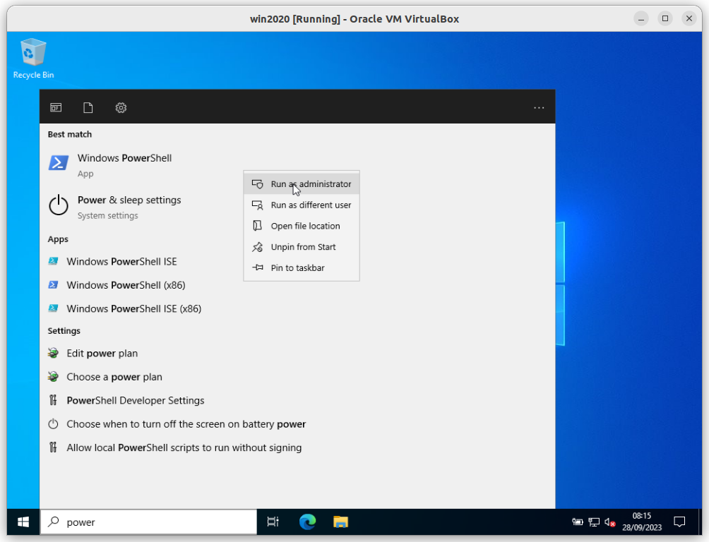
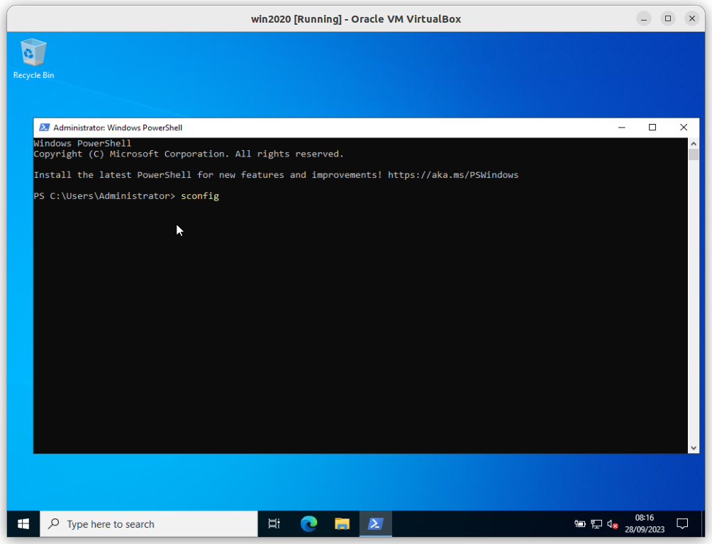
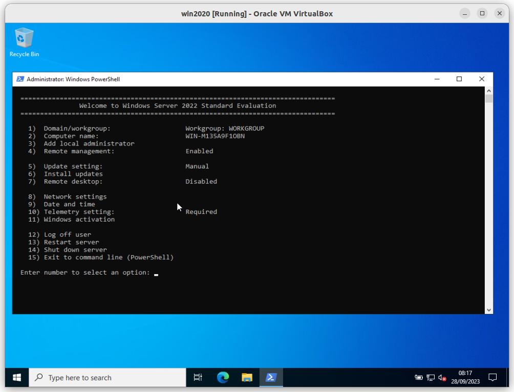
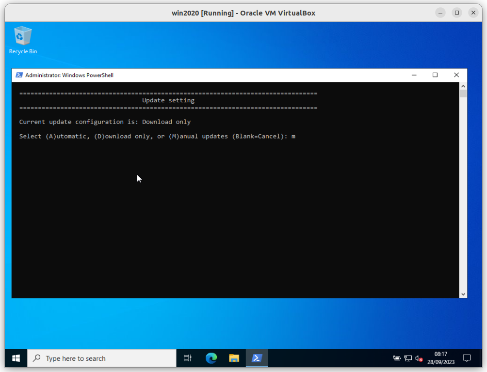
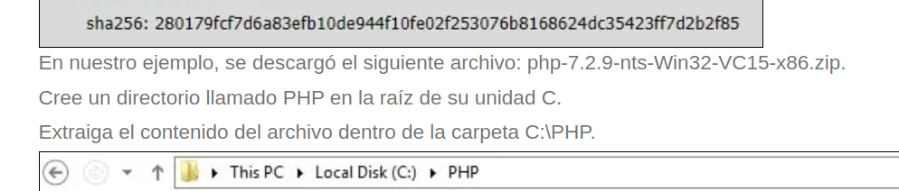
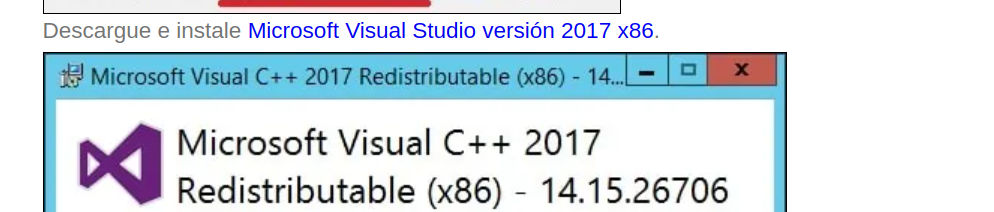
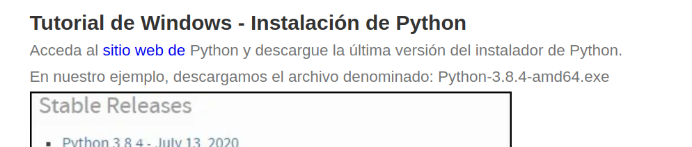
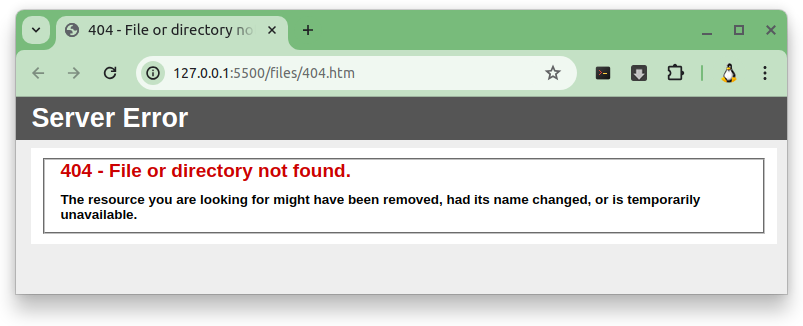
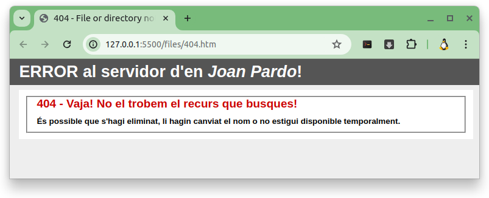
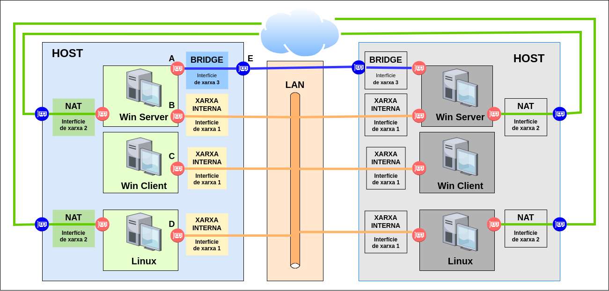

# A08U - Activitat 8: Servidor web IIS, més MV client i preparació entorn per Nagios

Aquesta és una activitat que tot i que es farà en grup, cal que cada alumne tingui TOTES les màquines funcionant al vostre portàtil. Aquesta és una condició imprescindible per poder fer els exàmens d'aquesta avaluació. 


## Índex

<details><summary>Pitja per veure l'Índex</summary>

### [*1.* Primera part (**`IIS`** amb **`PHP`** i **`Python`**)](#1-primera-part-iis-amb-php-i-python)
#### &nbsp;&nbsp;&nbsp;&nbsp;[*1.2.* Apartat extra dos discos](#part-12-apartat-extra-dos-discos)
#### &nbsp;&nbsp;&nbsp;&nbsp;[*1.3.* Instal·lar **`Python`**](#part-13-installar-python)
#### &nbsp;&nbsp;&nbsp;&nbsp;[*1.4.* Crear un **lloc web** (***web site***) al vostre servidor](#part-14-crear-un-lloc-web-web-site-al-vostre-servidor)
#### &nbsp;&nbsp;&nbsp;&nbsp;[*1.5.* Mostrar una pàgina personalitzada per l'**`ERROR 404`** d'**`HTML`**](#part-15-mostrar-una-pàgina-personalitzada-per-lerror-404-dhtml)
##### &nbsp;&nbsp;&nbsp;&nbsp;&nbsp;&nbsp;&nbsp;&nbsp;&nbsp;&nbsp;&nbsp;&nbsp;&nbsp;[*1.5.1.* Configurar el **`IIS`** per mostrar la pàgina per defecte.](#151-configurar-el-iis-per-mostrar-la-pàgina-per-defecte)
##### &nbsp;&nbsp;&nbsp;&nbsp;&nbsp;&nbsp;&nbsp;&nbsp;&nbsp;&nbsp;&nbsp;&nbsp;&nbsp;[*1.5.2.* Personalitzar una mica la pàgina per defecte de l'**`IIS`**](#152-personalitzar-una-mica-la-pàgina-per-defecte-de-liis)
##### &nbsp;&nbsp;&nbsp;&nbsp;&nbsp;&nbsp;&nbsp;&nbsp;&nbsp;&nbsp;&nbsp;&nbsp;&nbsp;[*1.5.3.* Personalitzar de manera radical la pàgina per defecte de l'**`IIS`**](#153-personalitzar-de-manera-radical-la-pàgina-per-defecte-de-liis)

</details>


## 1. Primera part (**`IIS`** amb **`PHP`** i **`Python`**)

### **Part 1.1.**: Instal·lar **servidor web** a un servidor **Windows 2019** amb **PHP** i **Python**

**Primer objectiu**: el primer objectiu d'aquesta activitat és muntar un **servidor web** amb **PHP** a un **Windows 2019** o a un **Windows 2022**, fent servir **`fastCGI`** i que sigui visible des d'una màquina virtual amb un sistema operatiu client.

* Per dur a terme l'activitat, caldrà fer servir el **servidor web `IIS`** (***Internet Information Services***) de **Microsoft**. I instal·lar i configurar:

* Aquesta és la pàgina web [**``info.php``**](./files/info.php) escrita amb **PHP** que estarà allotjada al servidor i caldrà veure des del client.

> El contingut del fitxer [**``info.php``**](./files/info.php) és el següent:
>
>```php
><?php
>    phpinfo();
>?>
>```

<hr>

## **Part 1.2.**: **Apartat extra** dos discos

Muntar el servidor amb dos discos.

<!--

### Pistes


A la pàgina oficial de [*PHP For Windows: Binaries and sources Releases*](https://windows.php.net/download/) podeu veure el següent apartat.

> ### Which version do I choose?
> 
> #### **IIS**
>
> If you are using **PHP as FastCGI with IIS** you should use the **Non-Thread Safe (NTS)** versions of **PHP**.
>
> (...)
>
> #### **VC15 & VS16**
>
> More recent versions of PHP are built with **`VC15`** or **`VS16`** (**Visual Studio 2017** or **2019** compiler respectively) and include improvements in performance and stability.
> 
> - The **`VC15`** and **`VS16`** builds require to have the **Visual C++ Redistributable for Visual Studio 2015-2019 x64** or **x86** installed
> 

Es recomana descarregar la versió **7.4.0 non-thread-safe** zip de la pàgina oficial de [*windows.php.net - /downloads/releases/archives/*](https://windows.php.net/downloads/releases/archives/).

[php-7.4.0-nts-Win32-vc15-x64.zip](https://windows.php.net/downloads/releases/archives/php-7.4.0-nts-Win32-vc15-x64.zip)

-->

<hr>

### Recomanació

És recomanable desactivar que **```Windows Update```** descarregui automàticament els paquets a instal·lar.

<details><summary>Pitja per veure els passos de la recomanació.</summary>

* Executa **`Windows PowerShell`** com **administrador**.



* Executa la comanda **`sconfig`**.



* Apareix el **menú principal** de **`sconfig`**.



* Escollir l'opció **`5`** que és **`Update setting`**.


* Pitja **`m`** per indicar que es vol escollir **`(M)anual updates `*.



* Tornem al **menú principal** de **`sconfig`**, i escollim l'opció **`15`** (**`15) Exit to command line (PowerShell)`**), per sortir. 


</details>

<hr>

### Enllaços d'interes

#### 1r pas instal·lar **`IIS`** a un servidor Windows

* [Tutorial de Windows 2012 - Instalación de IIS](https://techexpert.tips/es/windows-es/instalacion-de-iis-en-windows/)


#### 2n pas instal·lar a l'**`IIS`** d'un servidor Windows **`PHP`**

* [Instalación de PHP en IIS](https://techexpert.tips/es/windows-es/instalar-php-en-windows-server-iis/)

> [!TIP]
>
> ### Els fitxers que es fan servir si seguiu l'anterior enllaç els podeu trobar aquí:
>
> 
>
> **En nuestro ejemplo, se descargó el siguiente archivo:** [**`php-7.2.9-nts-Win32-VC15-x86.zip`**](./files/php-7.2.9-nts-Win32-VC15-x86.zip).
>
> 
>
> **Descargue e instale** [**`Microsoft Visual Studio versión 2017 x86`**](./files/VC_redist.x86.exe).
>


<hr>

## **Part 1.3.**: Instal·lar **`Python`**

Muntar el mòdul de **Python** en el **servidor web**  

#### Instal·lar a l'**`IIS`** d'un servidor Windows **`Python`**

* [Tutorial de Windows - Instalación de Python](https://techexpert.tips/es/iis-es/habilitar-python-en-iis/)

> [!TIP]
>
> ### Els fitxers que es fan servir si seguiu l'anterior enllaç els podeu trobar aquí:
>
> 
>
> **En nuestro ejemplo, descargamos el archivo denominado:** [**`Python-3.8.4-amd64.exe`**](./files/python-3.8.4-amd64.exe).
> 

<hr>

## **Part 1.4.**: Crear un **lloc web** (***web site***) al vostre servidor

Al següent enllaç a la secció [***IIS : Add Web Sites (GUI)***](https://www.server-world.info/en/note?os=Windows_Server_2019&p=iis&f=4) podeu trobar un manual de com crear-ne un.

El domini cal que sigui **`smx2.<elVostreCognom><elVostreNom>.cat`**

> Per exemple, en el meu cas seria **`smx2.pardojoan.cat`**

Que el **lloc web** es trobi a la ruta:

El domini cal que sigui **`C:\inetpub\wwwroot\smx2<elVostreCognom><elVostreNom>cat`**

> Per exemple, en el meu cas seria **`C:\inetpub\wwwroot\smx2pardojoancat`**

I cal que pengeu una pàgina web feta per vosaltres.

<hr>

## **Part 1.5.**: Mostrar una pàgina personalitzada per l'**`ERROR 404`** d'**`HTML`**

Un cop que ja tingueu el vostre **lloc web** funcionant correctament, cal que personalitzem les pàgines web que apareguin quan han de mostrar un error. 

### **Part 1.5.1.**: Configurar el **`IIS`** per mostrar la pàgina per defecte.

Configurar el servidor web per que mostri una pàgina personalitzada d'**`error 404`**

Cal que activeu dins del **`IIS`** el fet de que mostri aquesta o una altra pàgina quan se li demani un recurs que no estigui disponible.

Podeu seguir el següent enllaç [IIS - Redirija el error 404 a una página](https://techexpert.tips/es/iis-es/iis-redirija-el-error-404-a-una-pagina/) per poder-ho configurar.

Per defecte, quan al **servidor web** (**`IIS`**) se li demana una pàgina web o un recurs que no troba, apareix, per defecte la següent pàgina.



Aquesta pàgina **`404.htm`** es troba a la ruta **`C:\inetpub\custerr\en-US\`**, i el seu contingut és el següent.

```html
<html xmlns="http://www.w3.org/1999/xhtml" data-lt-installed="true"><head>
<meta http-equiv="Content-Type" content="text/html; charset=iso-8859-1">
<title>404 - File or directory not found.</title>
<style type="text/css">
<!--
body{margin:0;font-size:.7em;font-family:Verdana, Arial, Helvetica, sans-serif;background:#EEEEEE;}
fieldset{padding:0 15px 10px 15px;} 
h1{font-size:2.4em;margin:0;color:#FFF;}
h2{font-size:1.7em;margin:0;color:#CC0000;} 
h3{font-size:1.2em;margin:10px 0 0 0;color:#000000;} 
#header{width:96%;margin:0 0 0 0;padding:6px 2% 6px 2%;font-family:"trebuchet MS", Verdana, sans-serif;color:#FFF;
background-color:#555555;}
#content{margin:0 0 0 2%;position:relative;}
.content-container{background:#FFF;width:96%;margin-top:8px;padding:10px;position:relative;}
-->
</style>
</head>
<body>
<div id="header"><h1>Server Error</h1></div>
<div id="content">
 <div class="content-container"><fieldset>
  <h2>404 - File or directory not found.</h2>
  <h3>The resource you are looking for might have been removed, had its name changed, or is temporarily unavailable.</h3>
 </fieldset></div>
</div>


</body></html>
```

Podeu trobar el codi al següent fitxer [404.htm](./files/404.htm)

### **Part 1.5.2.**: Personalitzar una mica la pàgina per defecte de l'**`IIS`**

Un cop que el servidor ja mostri la pàgina de l'**error 404**, com que ja us he passat el codi **`html`**, cal que personalitzeu la pàgina i que es mostro el següent:



### **Part 1.5.3.**: Personalitzar de manera radical la pàgina per defecte de l'**`IIS`**

Ara, cal que creeu una pàgina molt més diferent a la pàgina per defecte de l'**`IIS`**. 

A continuació, us deixo uns quants exemples de **pàgines 404**:

[*Pàgina 404* de ***`lego.com`***](https://www.lego.com/es-es/hola)

[*Pàgina 404* de ***`github.com`***](https://github.com/holacomestas)

[*Pàgina 404* de ***`marvel.com`***](https://www.marvel.com/test)

[*Pàgina 404* de ***`ginebro.cat`***](https://www.ginebro.cat/test)

I aquí teniu un lloc web amb exemples [***`404-page-examples - weblium.com`***](https://weblium.com/blog/404-page-examples/)

<!-- ### **Apartat extra 3**

Crear una pàgina web amb **Python** en el **servidor web** que demani el nom de l'usuari i mostri el nom de l'usuari i l'adreça IP del servidor. El contingut del fitxer [**``prova.php``**](./files/prova.php) és el següent:

```php
<!DOCTYPE html>
<html lang="es">
    <head>
        <meta charset="UTF-8">
        <meta name="viewport" content="width=device-width, initial-scale=1.0">
        <title>Informació del nostre Servidor</title>
    </head>
    <body>
        <h1>Informació del nostre Servidor</h1>
        <?php
        // Per demanar el nom a l'usuari
        $nom = isset($_POST['nom']) ? htmlspecialchars($_POST['nom']) : '';
        // Mostrar el nom entrat per l'usuari
        if (!empty($nom)) {
            echo "<p>Hola $nom!</p>";
        }
        // Mostrar el nom del servidor i les seves adreces IP
        $nom_servidor = $_SERVER['SERVER_NAME'];
        $ip_servidor = gethostbyname($nom_servidor);
        echo "<p>Nom del servidor: $nom_servidor</p>";
        echo "<p>Adreça IP del servidor: $ip_servidor</p>";
        ?>
        <form method="post" action="">
            <label for="nom">Entra el teu nom:</label>
            <input type="text" name="nom" required>
            <button type="submit">Enviar</button>
        </form>
    </body>
</html>
``` -->

<!-- 
> El contingut del fitxer [**``exercici.php``**](./exercici.php) és el següent:
>```html
<!DOCTYPE html>
<html lang="es">
<head>
    <meta charset="UTF-8">
    <meta name="viewport" content="width=device-width, initial-scale=1.0">
    <title>Informació del nostre Servidor</title>
</head>
<body>
    <h1>Informació del nostre Servidor</h1>

    <?php
    // Per demanar el nom a l'usuari
    $nom = isset($_POST['nom']) ? htmlspecialchars($_POST['nom']) : '';

    // Mostrar el nom entrat per l'usuari
    if (!empty($nom)) {
        echo "<p>Hola $nom!</p>";
    }

    // Mostrar el nom del servidor i les seves adreces IP
    $nom_servidor = $_SERVER['SERVER_NAME'];
    $ip_servidor = gethostbyname($nom_servidor);

    echo "<p>Nom del servidor: $nom_servidor</p>";
    echo "<p>Adreça IP del servidor: $ip_servidor</p>";
    ?>

    <form method="post" action="">
        <label for="nom">Entra el teu nom:</label>
        <input type="text" name="nom" required>
        <button type="submit">Enviar</button>
    </form>
</body>
</html>
``` -->
<!-- 
## Segona part **`Servidor de fitxers`**

**Segon objectiu**: hi ha un segon objectiu d'aquesta activitat que és que el servidor Windows també faci de servidor de fitxers. I que a la màquina virtual client es pugui enllaçar una unitat compartida del servidor com a unitat del client.

* Per exemple:

Si en el servidor s'ha compatit la carpeta **`c:\recurs_compartit`** com **`recurs_compartit`**, a la màquina virtual client cal crear una unitat compartida **`Z:`** com **`\\<ip del vostre servidor>\recurs_compartit`**.

### Tercera part

**Tercer objectiu**: el tercer objectiu d'aquesta activitat és que el servidor Windows també la màquina virtual client es pugui enllaçar una unitat compartida del servidor com a unitat del client.

* Per exemple:

Si en el servidor del vostre company ha compatit la carpeta **`c:\recurs_compartit`** com **`recurs_compartit`**, a la màquina virtual client cal crear una unitat compartida **`Y:`** com **`\\<ip del servidor del vostre company>\recurs_compartit`**.

### **Apartat extra de la tercera part**

Automatitzar el fet que quan un usuari es connecti, automàticament se li connecti la unitat compartida **`Y:`** com **`\\<ip del servidor del vostre company>\recurs_compartit`**.

### Quarta part

**Quart objectiu**: cal que preparem un entorn per poder fer la següent activitat que fareu amb l'Iván Nieto. L'activitat es basarà en instal·lar i configurar un **`Nagios`**. Però no ens avancem, ja arribarà.

És per aquest darrer objectiu que cal que fem servir les adreces IP que es faciliten a continuació.

### Cinquena part

**Cinquè objectiu**: Si tot funciona com esperem, **TOTS** vosaltres podreu veure **TOTS** els servidor dels vostres companys. -->

<hr>

## Diagrama



## Assignació dels grups

### Grup 1

|Alumne/a|A<br>IP Windows<br>Server<br>`BRIDGE`|B<br>IP Windows<br>Server<br>`Xar. Int.`|C<br>IP Windows<br>Client<br>`Xar. Int.`|D<br>IP Linux<br>Nagios<br>`Xar. Int.`|E<br>IP Switch (host)<br>`Ethernet`|
|---|:---:|:---:|:---:|:---:|:---:|
|Agustí Corbella, Oriol|192.168.100.10 /24|192.168.100.11 /24|192.168.100.12 /24|192.168.100.13 /24|192.168.100.14 /24|
|Lamela Garcia, Alvaro Haoan|192.168.100.15 /24|192.168.100.16 /24|192.168.100.17 /24|192.168.100.18 /24|192.168.100.19 /24|
|Román Robles, Àlex|192.168.100.20 /24|192.168.100.21 /24|192.168.100.22 /24|192.168.100.23 /24|192.168.100.24 /24|
|Soler Sampere, Arnau|192.168.100.25 /24|192.168.100.26 /24|192.168.100.27 /24|192.168.100.28 /24|192.168.100.29 /24|


### Grup 2

|Alumne/a|A<br>IP Windows<br>Server<br>`BRIDGE`|B<br>IP Windows<br>Server<br>`Xar. Int.`|D<br>IP Windows<br>Client<br>`Xar. Int.`|D<br>IP Linux<br>Nagios<br>`Xar. Int.`|E<br>IP Switch (host)<br>`Ethernet`|
|---|:---:|:---:|:---:|:---:|:---:|
|Boada Cirera, Jan|192.168.100.30 /24|192.168.100.31 /24|192.168.100.32 /24|192.168.100.33 /24|192.168.100.34 /24|
|Cot Fontanella, Marc|192.168.100.35 /24|192.168.100.36 /24|192.168.100.37 /24|192.168.100.38 /24|192.168.100.39 /24|
|Putellas Martín, Pol|192.168.100.40 /24|192.168.100.41 /24|192.168.100.42 /24|192.168.100.43 /24|192.168.100.44 /24|
|Vázquez Pelàez, Alex|192.168.100.45 /24|192.168.100.46 /24|192.168.100.47 /24|192.168.100.48 /24|192.168.100.49 /24|


### Grup 3

|Alumne/a|A<br>IP Windows<br>Server<br>`BRIDGE`|B<br>IP Windows<br>Server<br>`Xar. Int.`|D<br>IP Windows<br>Client<br>`Xar. Int.`|D<br>IP Linux<br>Nagios<br>`Xar. Int.`|E<br>IP Switch (host)<br>`Ethernet`|
|---|:---:|:---:|:---:|:---:|:---:|
|Navarro Galan, Gerard|192.168.100.50 /24|192.168.100.51 /24|192.168.100.52 /24|192.168.100.53 /24|192.168.100.54 /24|
|Rueda Guàrdia, Marc|192.168.100.55 /24|192.168.100.56 /24|192.168.100.57 /24|192.168.100.58 /24|192.168.100.59 /24|
|Sellés Puyol, Aniol|192.168.100.60 /24|192.168.100.61 /24|192.168.100.62 /24|192.168.100.63 /24|192.168.100.64 /24|


### Grup 4

|Alumne/a|A<br>IP Windows<br>Server<br>`BRIDGE`|B<br>IP Windows<br>Server<br>`Xar. Int.`|D<br>IP Windows<br>Client<br>`Xar. Int.`|D<br>IP Linux<br>Nagios<br>`Xar. Int.`|E<br>IP Switch (host)<br>`Ethernet`|
|---|:---:|:---:|:---:|:---:|:---:|
|Capel Vallbona, Marc|192.168.100.65 /24|192.168.100.66/24|192.168.100.67 /24|192.168.100.68 /24|192.168.100.69 /24|
|Codina Garcia, Aleix|192.168.100.70 /24|192.168.100.71/24|192.168.100.72 /24|192.168.100.73 /24|192.168.100.74 /24|
|Deus Jurado, Izan|192.168.100.75 /24|192.168.100.76/24|192.168.100.77 /24|192.168.100.78 /24|192.168.100.79 /24|
|Ortiz Guerrero, Antoni|192.168.100.80 /24|192.168.100.81/24|192.168.100.82 /24|192.168.100.83 /24|192.168.100.84 /24|


### Grup 5

|Alumne/a|A<br>IP Windows<br>Server<br>`BRIDGE`|B<br>IP Windows<br>Server<br>`Xar. Int.`|D<br>IP Windows<br>Client<br>`Xar. Int.`|D<br>IP Linux<br>Nagios<br>`Xar. Int.`|E<br>IP Switch (host)<br>`Ethernet`|
|---|:---:|:---:|:---:|:---:|:---:|
|Pan, Jiahao|192.168.100.85 /24|192.168.100.86 /24|192.168.100.87 /24|192.168.100.88 /24|192.168.100.89 /24|
|Pan, Le|192.168.100.90 /24|192.168.100.91 /24|192.168.100.92 /24|192.168.100.93 /24|192.168.100.94 /24|
|Sacristan Castillo, Marc|192.168.100.95 /24|192.168.100.96 /24|192.168.100.97 /24|192.168.100.98 /24|192.168.100.99 /24|
|Sardaña Trinh, Marc|192.168.100.100 /24|192.168.100.101 /24|192.168.100.102 /24|192.168.100.103 /24|192.168.100.194 /24|


### Grup 6

|Alumne/a|A<br>IP Windows<br>Server<br>`BRIDGE`|B<br>IP Windows<br>Server<br>`Xar. Int.`|D<br>IP Windows<br>Client<br>`Xar. Int.`|D<br>IP Linux<br>Nagios<br>`Xar. Int.`|E<br>IP Switch (host)<br>`Ethernet`|
|---|:---:|:---:|:---:|:---:|:---:|
|Córdoba Xandri, Oriol|192.168.100.105 /24|192.168.100.106 /24|192.168.100.107 /24|192.168.100.108 /24|192.168.100.109 /24|
|Garcia Romero, Arnau|192.168.100.110 /24|192.168.100.111 /24|192.168.100.112 /24|192.168.100.113 /24|192.168.100.114 /24|
|Puriy Puriy, Nicolas|192.168.100.115 /24|192.168.100.116 /24|192.168.100.117 /24|192.168.100.118 /24|192.168.100.119 /24|
|Royuela Martín, Oriol|192.168.100.120 /24|192.168.100.121 /24|192.168.100.122 /24|192.168.100.123 /24|192.168.100.124 /24|


### Grup 7

|Alumne/a|A<br>IP Windows<br>Server<br>`BRIDGE`|B<br>IP Windows<br>Server<br>`Xar. Int.`|D<br>IP Windows<br>Client<br>`Xar. Int.`|D<br>IP Linux<br>Nagios<br>`Xar. Int.`|E<br>IP Switch (host)<br>`Ethernet`|
|---|:---:|:---:|:---:|:---:|:---:|
|Gálvez Comajuan, Marc|192.168.100.125 /24|192.168.100.126 /24|192.168.100.127 /24|192.168.100.128 /24|192.168.100.129 /24|
|Martinez Segú, Eric|192.168.100.130 /24|192.168.100.131 /24|192.168.100.132 /24|192.168.100.133 /24|192.168.100.134 /24|
|Moreno Fernández, Nil|192.168.100.135 /24|192.168.100.136 /24|192.168.100.137 /24|192.168.100.138 /24|192.168.100.139 /24|
|Sohl Brenes, Martin Albert|192.168.100.140 /24|192.168.100.141 /24|192.168.100.142 /24|192.168.100.143 /24|192.168.100.144 /24|


### Grup 8

|Alumne/a|A<br>IP Windows<br>Server<br>`BRIDGE`|B<br>IP Windows<br>Server<br>`Xar. Int.`|D<br>IP Windows<br>Client<br>`Xar. Int.`|D<br>IP Linux<br>Nagios<br>`Xar. Int.`|E<br>IP Switch (host)<br>`Ethernet`|
|---|:---:|:---:|:---:|:---:|:---:|
|Bollero Ruzafa, Ivan|192.168.100.145 /24|192.168.100.146 /24|192.168.100.147 /24|192.168.100.148 /24|192.168.100.149 /24|
|Casas Lopez, Raul|192.168.100.150 /24|192.168.100.151 /24|192.168.100.152 /24|192.168.100.153 /24|192.168.100.154 /24|
|Garcia Fernández, Adrià|192.168.100.155 /24|192.168.100.156 /24|192.168.100.157 /24|192.168.100.158 /24|192.168.100.159 /24|
|Morales Gonzalez, Jan|192.168.100.160 /24|192.168.100.161 /24|192.168.100.162 /24|192.168.100.163 /24|192.168.100.164 /24|


<!-- 

[Configurar un sitio web PHP en IIS (microsoft.com)](https://learn.microsoft.com/es-es/iis/application-frameworks/scenario-build-a-php-website-on-iis/configure-a-php-website-on-iis)

# [Paso 1: Instalación de IIS y PHP](./paso-01.md)

[Paso 1: Instalación de IIS y PHP (microsoft.com)](https://learn.microsoft.com/es-es/iis/application-frameworks/scenario-build-a-php-website-on-iis/configuring-step-2-configure-php-settings)

[Paso 2: Configurar PHP](https://learn.microsoft.com/es-es/iis/application-frameworks/scenario-build-a-php-website-on-iis/configuring-step-2-configure-php-settings)

[Paso 3: Configurar la seguridad de la aplicación PHP (microsoft.com)](https://learn.microsoft.com/es-es/iis/application-frameworks/scenario-build-a-php-website-on-iis/configuring-step-3-configure-php-application-security) -->