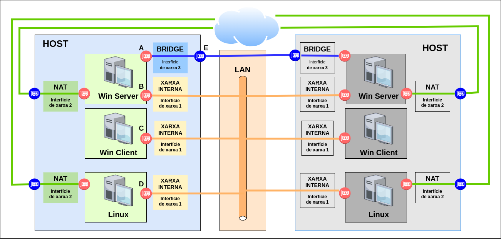

# A08U - Activitat 8: Servidor web IIS, més MV client i preparació entorn per Nagios

## Objectius

Aquesta és una activitat que tot i que es farà en grup, cal que cada alumne tingui TOTES les màquines funcionant al vostre portàtil. Aquesta és una condició imprescindible per poder fer els exàmens d'aquesta avaluació. 

### Primera part

**Primer objectiu**: el primer objectiu d'aquesta activitat és muntar un **servidor web** amb **PHP** a un **Windows 2019** o a un **Windows 2022** , fent servir **`fastCGI`** i que sigui visible des d'una màquina virtual amb un sistema operatiu client.

* Per dur a terme l'activitat, caldrà fer servir el **servidor web `IIS`** (***Internet Information Services***) de **Microsoft**. I instal·lar i configurar  

* Aquesta és la pàgina web [**``info.php``**](./info.php) escrita amb **PHP** que estarà allotjada al servidor i caldrà veure des del client.

> El contingut del fitxer [**``info.php``**](./info.php) és el següent:
>
>```php
><?php
>    phpinfo();
>?>
>```

### **Apartat extra**

Muntar el servidor amb dos discos.

<!-- 
> El contingut del fitxer [**``exercici.php``**](./exercici.php) és el següent:
>```html
<!DOCTYPE html>
<html lang="es">
<head>
    <meta charset="UTF-8">
    <meta name="viewport" content="width=device-width, initial-scale=1.0">
    <title>Informació del nostre Servidor</title>
</head>
<body>
    <h1>Informació del nostre Servidor</h1>

    <?php
    // Per demanar el nom a l'usuari
    $nom = isset($_POST['nom']) ? htmlspecialchars($_POST['nom']) : '';

    // Mostrar el nom entrat per l'usuari
    if (!empty($nom)) {
        echo "<p>Hola $nom!</p>";
    }

    // Mostrar el nom del servidor i les seves adreces IP
    $nom_servidor = $_SERVER['SERVER_NAME'];
    $ip_servidor = gethostbyname($nom_servidor);

    echo "<p>Nom del servidor: $nom_servidor</p>";
    echo "<p>Adreça IP del servidor: $ip_servidor</p>";
    ?>

    <form method="post" action="">
        <label for="nom">Entra el teu nom:</label>
        <input type="text" name="nom" required>
        <button type="submit">Enviar</button>
    </form>
</body>
</html>
``` -->

### Segona part

**Segon objectiu**: hi ha un segon objectiu d'aquesta activitat que és que el servidor Windows també faci de servidor de fitxers. I que a la màquina virtual client es pugui enllaçar una unitat compartida del servidor com a unitat del client.

* Per exemple:

Si en el servidor s'ha compatit la carpeta **`c:\recurs_compartit`** com **`recurs_compartit`**, a la màquina virtual client cal crear una unitat compartida **`Z:`** com **`\\<ip del vostre servidor>\recurs_compartit`**.


### Tercera part

**Tercer objectiu**: cal que preparem un entorn per poder fer la següent activitat que fareu amb l'Iván Nieto. L'activitat es basarà en instal·lar i configurar un **`Nagios`**. Però no ens avancem, ja arribarà.

És per aquest darrer objectiu que cal que fem servir les adreces IP que es faciliten a continuació.

### Quarta part

**Quart objectiu**: Si tot funciona com esperem, **TOTS** vosaltres podreu veure **TOTS** els servidor dels vostres companys.

<hr>

## Diagrama



## Assignació dels grups

### Grup 1

|Alumne/a|A<br>IP Windows<br>Server<br>`Xar. Int.`|B<br>IP Server<br>Windows<br>`BRIDGE`|D<br>IP Windows<br>Client<br>`Xar. Int.`|C<br><br>IP Switch (host)<br>`Ethernet`|E<br>IP Linux<br>Nagios<br>`Xar. Int.`|
|---|:---:|:---:|:---:|:---:|:---:|
|Agustí Corbella, Oriol|192.168.100.10 /24|192.168.100.11 /24|192.168.100.12 /24|192.168.100.13 /24|192.168.100.14 /24|
|Lamela Garcia, Alvaro Haoan|192.168.100.15 /24|192.168.100.16 /24|192.168.100.17 /24|192.168.100.18 /24|192.168.100.19 /24|
|Román Robles, Àlex|192.168.100.20 /24|192.168.100.21 /24|192.168.100.22 /24|192.168.100.23 /24|192.168.100.24 /24|
|Soler Sampere, Arnau|192.168.100.25 /24|192.168.100.26 /24|192.168.100.27 /24|192.168.100.28 /24|192.168.100.29 /24|


### Grup 2

|Alumne/a|A<br>IP Windows<br>Server<br>`Xar. Int.`|B<br>IP Server<br>Windows<br>`BRIDGE`|D<br>IP Windows<br>Client<br>`Xar. Int.`|C<br><br>IP Switch (host)<br>`Ethernet`|E<br>IP Linux<br>Nagios<br>`Xar. Int.`|
|---|:---:|:---:|:---:|:---:|:---:|
|Boada Cirera, Jan|192.168.100.30 /24|192.168.100.31 /24|192.168.100.32 /24|192.168.100.33 /24|192.168.100.34 /24|
|Cot Fontanella, Marc|192.168.100.35 /24|192.168.100.36 /24|192.168.100.37 /24|192.168.100.38 /24|192.168.100.39 /24|
|Putellas Martín, Pol|192.168.100.40 /24|192.168.100.41 /24|192.168.100.42 /24|192.168.100.43 /24|192.168.100.44 /24|
|Vázquez Pelàez, Alex|192.168.100.45 /24|192.168.100.46 /24|192.168.100.47 /24|192.168.100.48 /24|192.168.100.49 /24|


### Grup 3

|Alumne/a|A<br>IP Windows<br>Server<br>`Xar. Int.`|B<br>IP Server<br>Windows<br>`BRIDGE`|D<br>IP Windows<br>Client<br>`Xar. Int.`|C<br><br>IP Switch (host)<br>`Ethernet`|E<br>IP Linux<br>Nagios<br>`Xar. Int.`|
|---|:---:|:---:|:---:|:---:|:---:|
|Navarro Galan, Gerard|192.168.100.50 /24|192.168.100.51 /24|192.168.100.52 /24|192.168.100.53 /24|192.168.100.54 /24|
|Rueda Guàrdia, Marc|192.168.100.55 /24|192.168.100.56 /24|192.168.100.57 /24|192.168.100.58 /24|192.168.100.59 /24|
|Sellés Puyol, Aniol|192.168.100.60 /24|192.168.100.61 /24|192.168.100.62 /24|192.168.100.63 /24|192.168.100.64 /24|


### Grup 4

|Alumne/a|A<br>IP Windows<br>Server<br>`Xar. Int.`|B<br>IP Server<br>Windows<br>`BRIDGE`|D<br>IP Windows<br>Client<br>`Xar. Int.`|C<br><br>IP Switch (host)<br>`Ethernet`|E<br>IP Linux<br>Nagios<br>`Xar. Int.`|
|---|:---:|:---:|:---:|:---:|:---:|
|Capel Vallbona, Marc|192.168.100.65 /24|192.168.100.66/24|192.168.100.67 /24|192.168.100.68 /24|192.168.100.69 /24|
|Codina Garcia, Aleix|192.168.100.70 /24|192.168.100.71/24|192.168.100.72 /24|192.168.100.73 /24|192.168.100.74 /24|
|Deus Jurado, Izan|192.168.100.75 /24|192.168.100.76/24|192.168.100.77 /24|192.168.100.78 /24|192.168.100.79 /24|
|Ortiz Guerrero, Antoni|192.168.100.80 /24|192.168.100.81/24|192.168.100.82 /24|192.168.100.83 /24|192.168.100.84 /24|


### Grup 5

|Alumne/a|A<br>IP Windows<br>Server<br>`Xar. Int.`|B<br>IP Server<br>Windows<br>`BRIDGE`|D<br>IP Windows<br>Client<br>`Xar. Int.`|C<br><br>IP Switch (host)<br>`Ethernet`|E<br>IP Linux<br>Nagios<br>`Xar. Int.`|
|---|:---:|:---:|:---:|:---:|:---:|
|Pan, Jiahao|192.168.100.85 /24|192.168.100.86 /24|192.168.100.87 /24|192.168.100.88 /24|192.168.100.89 /24|
|Pan, Le|192.168.100.90 /24|192.168.100.91 /24|192.168.100.92 /24|192.168.100.93 /24|192.168.100.94 /24|
|Sacristan Castillo, Marc|192.168.100.95 /24|192.168.100.96 /24|192.168.100.97 /24|192.168.100.98 /24|192.168.100.99 /24|
|Sardaña Trinh, Marc|192.168.100.100 /24|192.168.100.101 /24|192.168.100.102 /24|192.168.100.103 /24|192.168.100.194 /24|


### Grup 6

|Alumne/a|A<br>IP Windows<br>Server<br>`Xar. Int.`|B<br>IP Server<br>Windows<br>`BRIDGE`|D<br>IP Windows<br>Client<br>`Xar. Int.`|C<br><br>IP Switch (host)<br>`Ethernet`|E<br>IP Linux<br>Nagios<br>`Xar. Int.`|
|---|:---:|:---:|:---:|:---:|:---:|
|Córdoba Xandri, Oriol|192.168.100.105 /24|192.168.100.106 /24|192.168.100.107 /24|192.168.100.108 /24|192.168.100.109 /24|
|Garcia Romero, Arnau|192.168.100.110 /24|192.168.100.111 /24|192.168.100.112 /24|192.168.100.113 /24|192.168.100.114 /24|
|Puriy Puriy, Nicolas|192.168.100.115 /24|192.168.100.116 /24|192.168.100.117 /24|192.168.100.118 /24|192.168.100.119 /24|
|Royuela Martín, Oriol|192.168.100.120 /24|192.168.100.121 /24|192.168.100.122 /24|192.168.100.123 /24|192.168.100.124 /24|


### Grup 7

|Alumne/a|A<br>IP Windows<br>Server<br>`Xar. Int.`|B<br>IP Server<br>Windows<br>`BRIDGE`|D<br>IP Windows<br>Client<br>`Xar. Int.`|C<br><br>IP Switch (host)<br>`Ethernet`|E<br>IP Linux<br>Nagios<br>`Xar. Int.`|
|---|:---:|:---:|:---:|:---:|:---:|
|Gálvez Comajuan, Marc|192.168.100.125 /24|192.168.100.126 /24|192.168.100.127 /24|192.168.100.128 /24|192.168.100.129 /24|
|Martinez Segú, Eric|192.168.100.130 /24|192.168.100.131 /24|192.168.100.132 /24|192.168.100.133 /24|192.168.100.134 /24|
|Moreno Fernández, Nil|192.168.100.135 /24|192.168.100.136 /24|192.168.100.137 /24|192.168.100.138 /24|192.168.100.139 /24|
|Sohl Brenes, Martin Albert|192.168.100.140 /24|192.168.100.141 /24|192.168.100.142 /24|192.168.100.143 /24|192.168.100.144 /24|


### Grup 8

|Alumne/a|A<br>IP Windows<br>Server<br>`Xar. Int.`|B<br>IP Server<br>Windows<br>`BRIDGE`|D<br>IP Windows<br>Client<br>`Xar. Int.`|C<br><br>IP Switch (host)<br>`Ethernet`|E<br>IP Linux<br>Nagios<br>`Xar. Int.`|
|---|:---:|:---:|:---:|:---:|:---:|
|Bollero Ruzafa, Ivan|192.168.100.145 /24|192.168.100.146 /24|192.168.100.147 /24|192.168.100.148 /24|192.168.100.149 /24|
|Casas Lopez, Raul|192.168.100.150 /24|192.168.100.151 /24|192.168.100.152 /24|192.168.100.153 /24|192.168.100.154 /24|
|Garcia Fernández, Adrià|192.168.100.155 /24|192.168.100.156 /24|192.168.100.157 /24|192.168.100.158 /24|192.168.100.159 /24|
|Morales Gonzalez, Jan|192.168.100.160 /24|192.168.100.161 /24|192.168.100.162 /24|192.168.100.163 /24|192.168.100.164 /24|


<!-- 

[Configurar un sitio web PHP en IIS (microsoft.com)](https://learn.microsoft.com/es-es/iis/application-frameworks/scenario-build-a-php-website-on-iis/configure-a-php-website-on-iis)

# [Paso 1: Instalación de IIS y PHP](./paso-01.md)

[Paso 1: Instalación de IIS y PHP (microsoft.com)](https://learn.microsoft.com/es-es/iis/application-frameworks/scenario-build-a-php-website-on-iis/configuring-step-2-configure-php-settings)

[Paso 2: Configurar PHP](https://learn.microsoft.com/es-es/iis/application-frameworks/scenario-build-a-php-website-on-iis/configuring-step-2-configure-php-settings)

[Paso 3: Configurar la seguridad de la aplicación PHP (microsoft.com)](https://learn.microsoft.com/es-es/iis/application-frameworks/scenario-build-a-php-website-on-iis/configuring-step-3-configure-php-application-security) -->