  Tutorial - Instalación de IIS en Windows \[ Paso a paso \]      

Instalación de `PHP` en `IIS`
=============================

Instalación de `PHP` en `IIS`
-----------------------------

¿Le gustaría aprender a instalar `PHP` en el servidor `IIS` ? En este tutorial, vamos a mostrarle cómo instalar y configurar `PHP` en el servidor `IIS` .

• Windows 2012 R2  
• Windows 2016  
• Windows 2019  
• PHP 7

Tutorial `IIS` - Instalación de `PHP` en Windows
------------------------------------------------

En primer lugar, necesitamos acceder al [sitio web de `PHP` para Windows.](./error404.html)

Localice y descargue las versiones no seguras para subprocesos (NTS) de `PHP`.

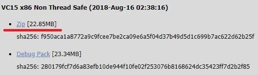

En nuestro ejemplo, se descargó el siguiente archivo: `php-7.2.9-nts-Win32-VC15-x86.zip`.

Cree un directorio llamado `PHP` en la raíz de su unidad `C`.

Extraiga el contenido del archivo dentro de la carpeta `C:\PHP`.

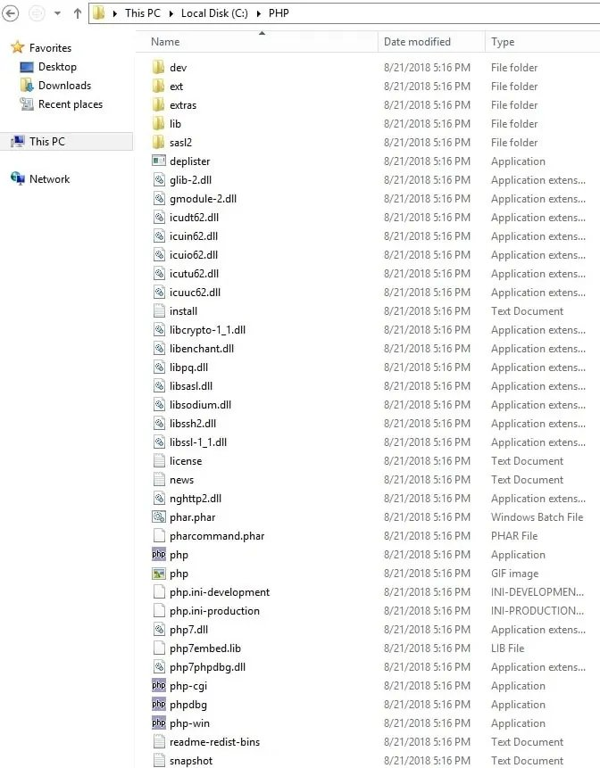

`PHP` para Windows requiere la instalación de una versión específica de Microsoft Visual Studio.

En nuestro ejemplo, descargamos la compilación del paquete `PHP VC15`.

`PHP Build VC 15` requiere la instalación de `Microsoft Visual Studio` versión 2017.

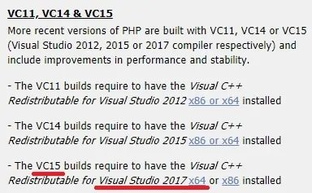

Descargue e instale [Microsoft Visual Studio versión 2017 x86](./error404.html).

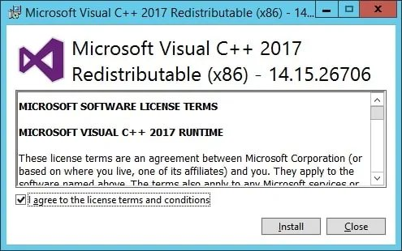

Después de finalizar la instalación de **Visual Studio**, necesitamos agregar `C:\PHP` a la variable de entorno `PATH`.

Acceda a la ventana `Propiedades del sistema`.

Acceda a la pestaña `Avanzadas` y haga clic en el botón `Variables de entorno`.

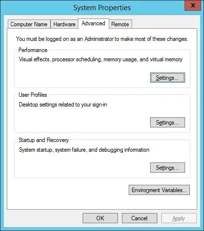

Seleccione la variable `PATH` y haga clic en el botón `Editar`.

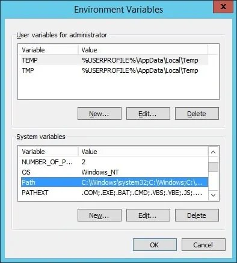

Agregue el directorio `PHP` al final del valor de la variable `PATH`.

`C:\PHP`

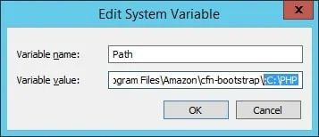

Abra la aplicación del explorador de Windows y acceda a la carpeta `PHP`.

Localice el archivo denominado `PHP.INI-PRODUCTION`.

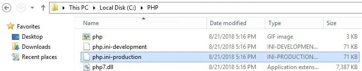

Cambie el nombre de `PHP.INI-PRODUCTION` a `PHP.INI`.

Edite el archivo llamado `PHP.INI`.

Aquí está el archivo original, antes de nuestra configuración:

`; date.timezone =   ; fastcgi.impersonate = 1   ; cgi.fix_pathinfo=1   ; cgi.force_redirect = 1   ; extension_dir = "ext"   ; extension=bz2   ; extension=curl   ; extension=gd2   ; extension=ldap   ; extension=mbstring   ; extension=mysqli   ; extension=openssl   `

Aquí está el archivo, después de nuestra configuración.

Tenga en cuenta que su archivo de `**zona horaria**` `PHP` puede no ser el mismo mío.

`date.timezone = America/Sao_Paulo   fastcgi.impersonate = 1   cgi.fix_pathinfo=1   cgi.force_redirect = 0   extension_dir = "ext"   extension=bz2   extension=curl   extension=gd2   extension=ldap   extension=mbstring   extension=mysqli   extension=openssl   `

Pruebe la instalación de `PHP`.

Abra un símbolo del sistema de DOS y escriba el siguiente comando.

`C:\> php -info   phpinfo()   PHP Version => 7.2.9   System => Windows NT TECH-DC01 6.3 build 9600 (Windows Server 2012 R2 Standard dition) i586   Build Date => Aug 15 2018 23:05:53   Compiler => MSVC15 (Visual C++ 2017)   Architecture => x86   `

¡Felicitaciones! ha instalado `PHP` en el servidor Windows.
-----------------------------------------------------------

  

* * *

  

Tutorial - Instalación de `IIS` en Windows
------------------------------------------

Abra la aplicación `Administrador del servidor`.

Acceda al menú `Administrar` y haga clic en `Agregar roles y características`.

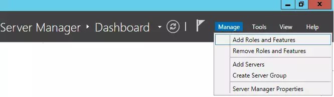

Acceda a la pantalla `Roles de servidor`, seleccione la opción `Servidor web (**IIS**)` y haga clic en el botón `Siguiente`.

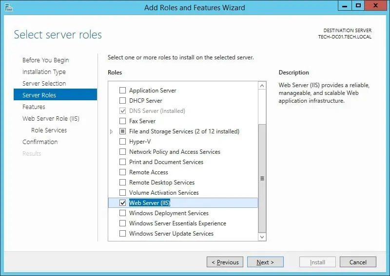

En la siguiente pantalla, haga clic en el botón `Agregar características`.

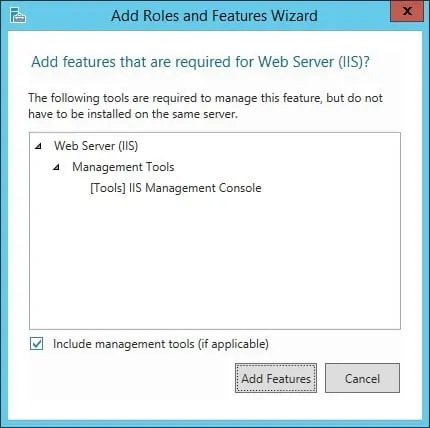

En la pantalla del servicio `IIS` , seleccione la opción `CGI` y finalice la instalación.

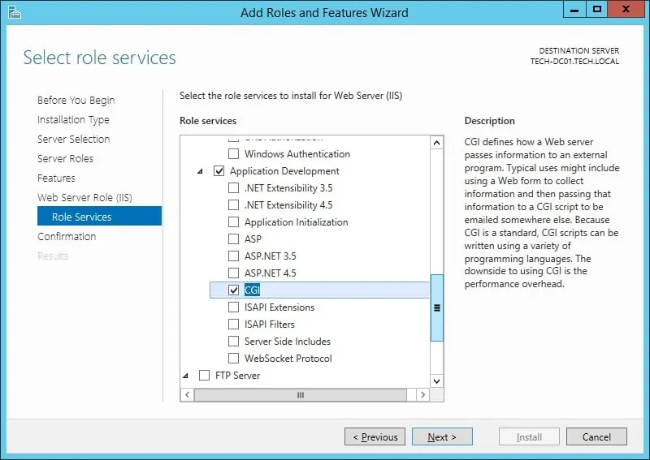

El servidor `IIS` se instaló en su computadora, pero todavía necesitamos configurar la integración `PHP`.

Abra la aplicación del administrador de `IIS` y acceda a la opción `Asignaciones de controlador`.

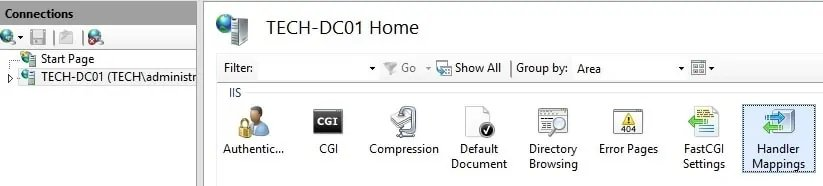

En la parte derecha de la pantalla, seleccione la opción denominada: `Agregar asignación de módulos`.

En la pantalla `Asignación de módulos`, deberá introducir la siguiente información:

• **Request Path** - `*.php`  
• **Module** - `FastCGIModule`  
• **Executable** - `C:\php\php-cgi.exe`  
• **Name** - `PHP`  

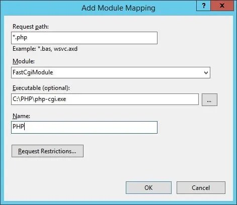

Haga clic en el botón denominado: `Solicitar restricciones`.

Seleccione la opción `Archivo o Carpeta` y haga clic en el botón `Aceptar`.

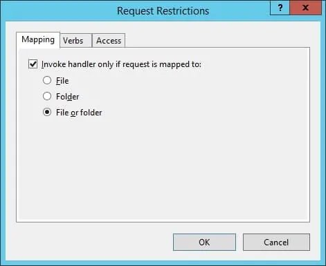

Haga clic en el botón `Aceptar`.

Si se presenta el siguiente mensaje, haga clic en el botón `Sí`.

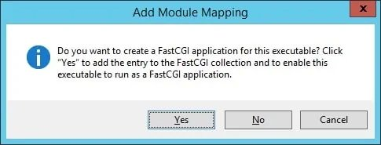

Ahora, necesitamos configurar `IIS` para aceptar `index.php` como una página predeterminada.

Abra la aplicación del administrador de `IIS` y acceda a la opción `Documento predeterminado`.

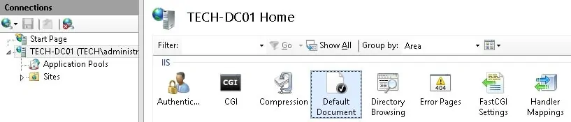

En la parte derecha de la pantalla, seleccione la opción denominada: `Añadir...`

En la ventana `Agregar documento predeterminado`, deberá introducir la siguiente información:

`` `index.php` ``

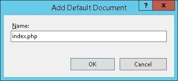

Para finalizar la instalación, debe reiniciar el servicio `IIS` .

Haga clic con el botón derecho en el nombre del servidor en la parte superior izquierda de la pantalla y seleccione la opción `Detener`.

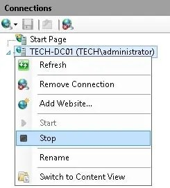

Haga clic con el botón derecho en el nombre del servidor en la parte superior izquierda de la pantalla y seleccione la opción `Iniciar`.

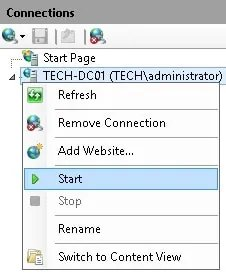

¡Felicitaciones! Ha instalado `PHP` en el servidor Windows.
-----------------------------------------------------------

El servidor `IIS` ahora es compatible con el uso de `PHP`.

Prueba de la instalación de `PHP` en Windows `IIS`
--------------------------------------------------

Abra la aplicación del bloc de notas y cree un documento denominado test.php

Este documento se debe colocar dentro de la carpeta `wwwroot`.

 `<?php      phpinfo();    ?>`

Abra el explorador e introduzca la dirección IP del servidor web `IIS` más `/test.php`

En nuestro ejemplo, se introdujo la siguiente URL en el navegador:

`http://`**<laIpDelVostreServidor>**`/test.php`

Se debe presentar el siguiente contenido.

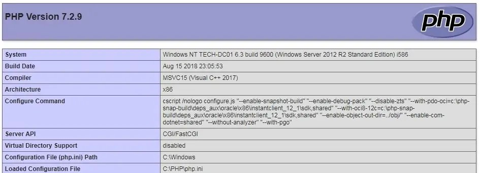

La instalación de `PHP` en `IIS` se ha probado correctamente.