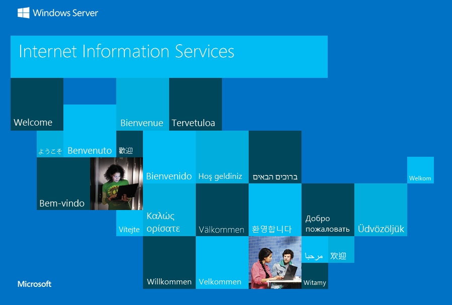

# Configuració del pas 1: Instal·lació d'IIS i PHP

En aquest article

[* Instal·lació d'IIS](#11-installació-diis)

[* Descarregar i instal·lar PHP manualment](#12-descarregar-i-installar-php-manualment)

[* Afegir l'aplicació PHP](#13-afegir-laplicació-php)

En aquest pas de la creació d'un lloc web PHP, instal·leu IIS i FastCGI, descarregueu i instal·leu PHP i l'extensió WinCache i carregueu l'aplicació PHP.

Quan hàgiu acabat, assegureu-vos que l'IIS i el PHP estiguin instal·lats i que s'hagi afegit l'aplicació PHP al vostre lloc web. A continuació, aneu al pas 2: Configurar les opcions de PHP.


## 1.1. Instal·lació d'IIS

Per instal·lar IIS, seguiu aquests passos:

Per instal·lar IIS al Windows Server 2012

1. A la pantalla **Inicio**, feu clic a la icona **Administrador del servidor** i després feu clic a **Acceptar**.

1. A **Administrador del servidor**, seleccioneu **Panel** i després feu clic a **Agregar roles y características**.

1. Al **Asistente para agregar roles y características**, a la pàgina **Antes de comenzar**, feu clic a **Siguiente**.

1. A la pàgina **Seleccionar tipo de instalación**, seleccioneu **Instalación basada en características o en roles** i després feu clic a **Siguiente**.

1. A la pàgina **Seleccionar servidor de destino**, seleccioneu **Seleccionar un servidor del grupo de servidores** i feu clic a **Siguiente**.

1. A la pàgina **Seleccionar roles de servidor**, seleccioneu **Servidor web (IIS)** i feu clic a **Siguiente**.

1. A la pàgina **Seleccionar características**, observeu les característiques preseleccionades que s'instal·len per defecte i després seleccioneu **CGI**. Aquesta selecció també instal·la **FastCGI**, que es recomana per a les aplicacions **PHP**.

1. Feu clic a **Siguiente**.

1. A la pàgina **Rol Servidor web (IIS)**, feu clic a **Siguiente**.

1. A la pàgina Seleccionar serveis de rol, observeu els serveis de rol preseleccionats que estan instal · lats per defecte i després feu clic a **Siguiente**.

    >![Warning]
    > **Nota**: Només heu d'instal·lar els serveis de rol predeterminats de l'IIS 8 per a un servidor web de contingut estàtic.
    > 

1. A la pàgina **Confirmar selecciones de instalación**, confirma les seleccions i fes clic a **Instalar**.

1. A la pàgina **Progreso de la instalación**, confirmeu que la instal·lació del rol de servidor web (IIS) i dels serveis de rol requerits ha finalitzat correctament i després feu clic a **Cerrar**.

Per comprovar que **IIS** s'ha instal·lat correctament, escriu el següent en un navegador web:

```
http://localhost
```

Hauries de veure la pàgina de benvinguda d'IIS.



## 1.2. Descarregar i instal·lar PHP manualment

Els procediments d'aquesta secció us guien per instal·lar PHP Manualment:

* [Descarregar PHP i extensió WinCache.](#121-per-descarregar-i-installar-php-i-wincache)

* Instal·lar PHP i WinCache.

* Afegiu la carpeta d'instal·lació del PHP a la variable d'entorn de ruta d'accés.

* Configureu una assignació de controlador per a PHP.

* Afegiu entrades de document predeterminades per a PHP.

* Comproveu la instal·lació de PHP.

* Per simplificar aquest procediment, instal·leu l'extensió WinCache però no la configureu. Configurarà i provarà WinCache al pas 2: Configurar les opcions de PHP.

## 1.2.1 Per descarregar i instal·lar PHP i WinCache

1. Obriu el navegador a [Windows per a la pàgina de descàrrega de PHP](https://windows.php.net/download/) i descarregueu el paquet zip **Non Thread Safe** (***no segur per a subprocessos***) php.

1. Descarregueu l'extensió WinCache de la llista d'extensions de Windows per a PHP.

1. Extraieu tots els fitxers del paquet de.zip PHP en una carpeta de la vostra elecció, per exemple C:\PHP\.

1. Extraieu el paquet.zip winCache a la carpeta d'extensions PHP (\ext), per exemple C:\PHP\ext. El paquet comprimit de WinCache conté un fitxer (Php_wincache.dll).

1. Obriu Panel de Control i feu clic successivament a Sistema i seguretat, Sistema i Configuració avançada del sistema.

1. A la finestra Propietats del sistema, seleccioneu la pestanya Opcions avançades i després feu clic a Variables d'entorn.

1. A Variables del sistema, seleccioneu Path, i després feu clic a Edita.

1. Afegiu la ruta d'accés a la carpeta d'instal·lació de PHP al final del valor variable, per exemple ;C:\PHP. Feu clic a OK.

1. Obriu l'Administrador de l'IIS, seleccioneu el nom d'amfitrió de l'ordinador al panell Connexions i feu doble clic a Assignacions de controlador.

1. Al panell Acció, feu clic a Afegeix assignació de mòdul.

1. A Ruta d'accés de sol·licitud, escriviu *.php.

1. Des del menú Mòdul, seleccioneu FastCgiModule.

1. Al quadre Executable, escriviu la ruta d'accés completa a Php-cgi.exe, per exemple C:\PHP\Php-cgi.exe.

1. A Nom, escriviu un nom per a l'assignació de mòdul, per exemple, FastCGI.

1. Feu clic a OK.

1. Seleccioneu el nom d'amfitrió de l'ordinador al panell Connexions del panell i feu doble clic a Document predeterminat.

1. Al panell Acció, feu clic a Afegeix. Escriviu Index.php al quadre Nom i feu clic a D'acord.

1. Torneu a fer clic a Afegeix. Escriviu Default.php al quadre Nom i feu clic a D'acord.

Per comprovar la instal·lació de PHP

Obriu un editor de text, per exemple, el Bloc de notes, com a administrador.

En un fitxer nou, escriviu el text següent:<?php phpinfo(); ?>

Deseu el fitxer com a C:\inetpub\wwwroot\Phpinfo.php.

Obriu un navegador i escriviu la següent adreça URL:

http://localhost/phpinfo.php

Es mostra una pàgina web amb un format clar que mostra la configuració actual de PHP.


## 1.3. Afegir l'aplicació PHP
Quan hàgiu instal·lat IIS i PHP, podeu afegir una aplicació PHP al servidor web. Aquesta secció descriu com configurar l'aplicació PHP en un servidor web IIS amb PHP instal·lat. No s'explica com desenvolupar una aplicació PHP.

Per afegir una aplicació web PHP
Obriu Administrador d'IIS.

Per al Windows Server 2012, a la pàgina Inici, feu clic a la icona Administrador del servidor i, a continuació, feu clic a D'acord. Al Tauler d'administrador del servidor, feu clic al menú Eines i després feu clic a Administrador d'Internet Information Services (IIS).
Per a Windows 8, a la pàgina Inici escriviu Tauler de control i, a continuació, feu clic a la icona Tauler de control als resultats de la cerca. A la pantalla Tauler de control, feu clic successivament a Sistema i seguretat, Eines administratives i Administrador d'Internet Information Services (IIS).
Al panell Connexions, feu clic amb el botó secundari al node Llocs de l'arbre i després feu clic a Afegeix lloc web.

Al quadre de diàleg Afegeix lloc web escriu un nom descriptiu per al teu lloc web al quadre Nom del lloc.

Si voleu seleccionar un grup d'aplicacions diferent del que apareix al quadre Grup d'aplicacions, feu clic a Selecciona. Al quadre de diàleg Seleccionar grup d'aplicacions, seleccioneu un grup d'aplicacions de la llista Grup d'aplicacions i feu clic a D'acord.

Al quadre Ruta d'accés física, escriviu la ruta d'accés física de la carpeta del lloc web o feu clic al botó Examinar (... ) per desplaçar-vos pel sistema de fitxers i cercar la carpeta.

Si la ruta d'accés física que heu escrit al pas 5 és un recurs compartit remot, feu clic a Connecta com per especificar les credencials que tenen permís per accedir a la ruta d'accés. Si no utilitzeu credencials específiques, seleccioneu l'opció Usuari de l'aplicació (autenticació de pas a través) al quadre de diàleg Connectar com.

Seleccioneu el protocol per al lloc web de la llista Tipus.

El valor per defecte del quadre Adreça IP és Totes les no assignades. Si heu d'especificar una adreça IP estàtica per al lloc web, escriviu l'adreça IP al quadre Adreça IP.

Escriviu un número de port al quadre de text Port.

Opcionalment, escriviu un nom de capçalera host per al lloc web al quadre Capçalera host.

Si no cal fer canvis al lloc i voleu que el lloc web estigui disponible immediatament, seleccioneu la casella Inicia lloc web immediatament.

Feu clic a D'acord.